# OnBeat合拍 - 完整交互流程图

## 1. 用户认证流程

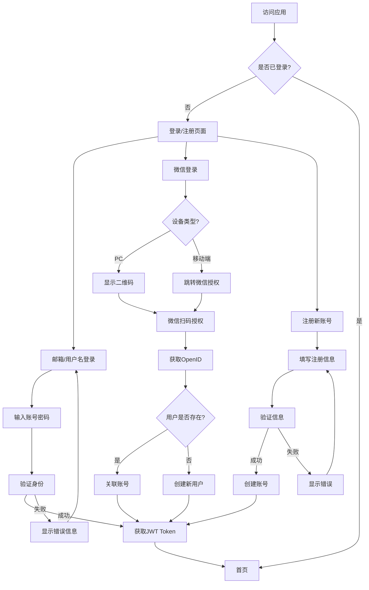

## 2. 首页浏览流程

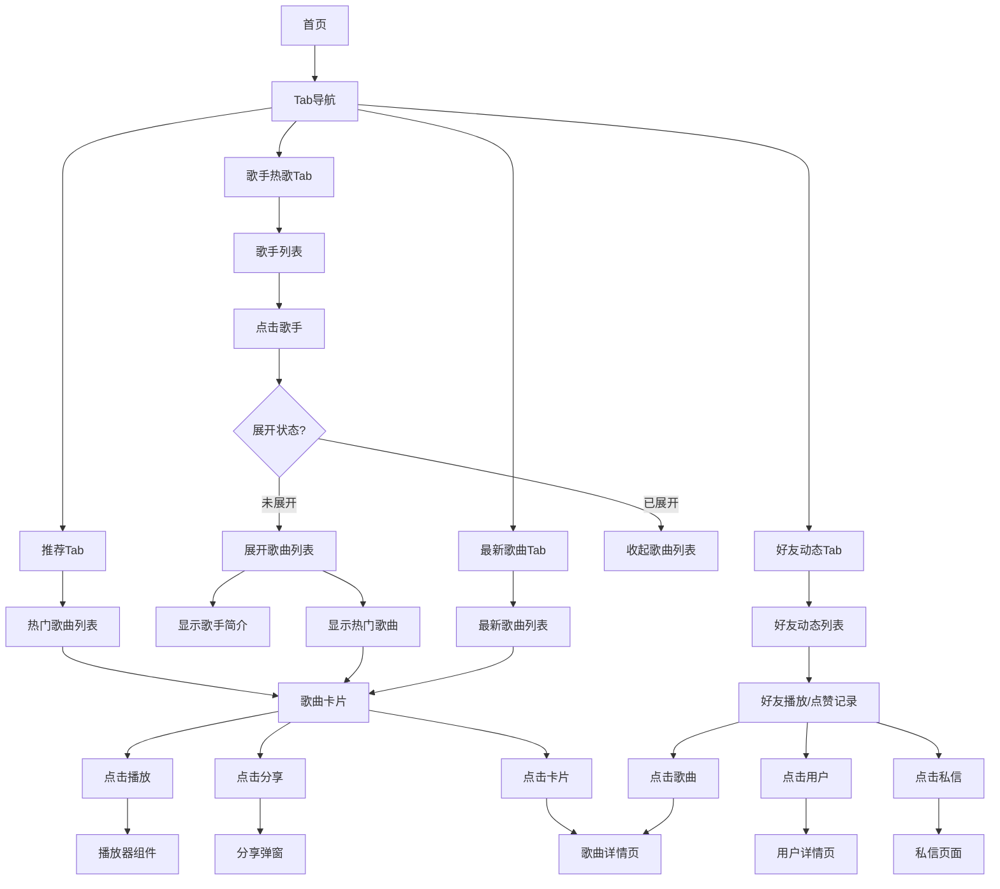

## 3. 歌曲详情页流程

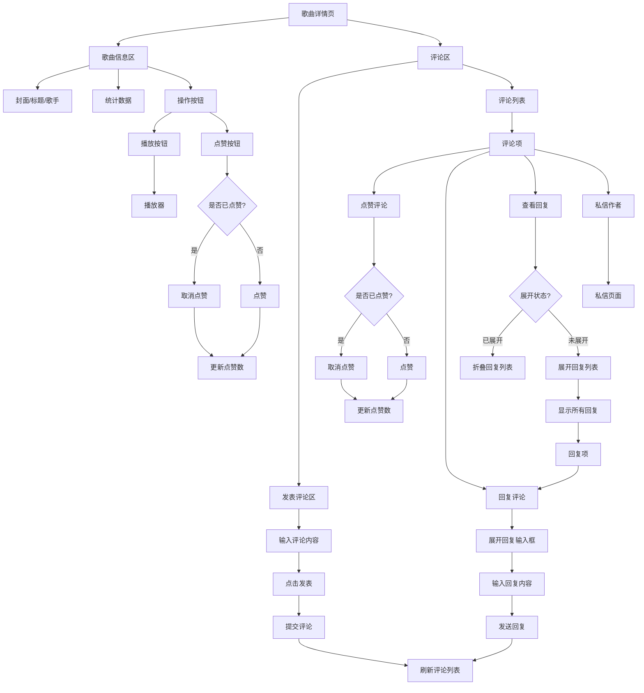

## 4. 用户详情页流程

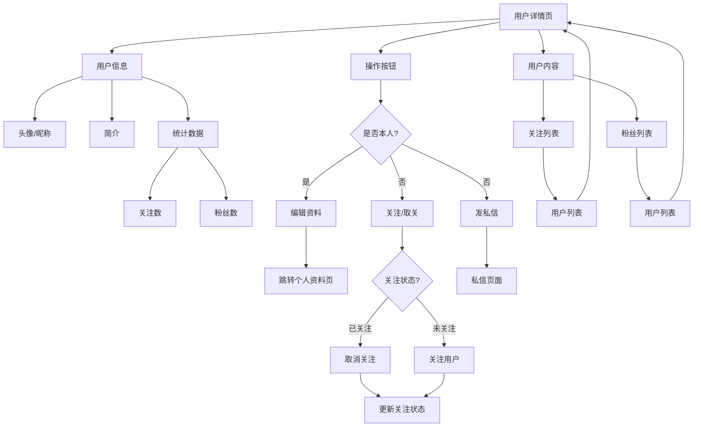

## 5. 私信功能流程

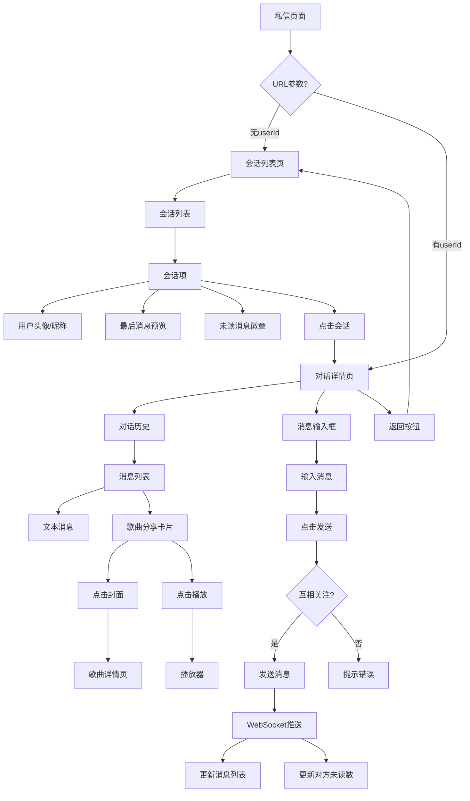

## 6. 分享功能流程

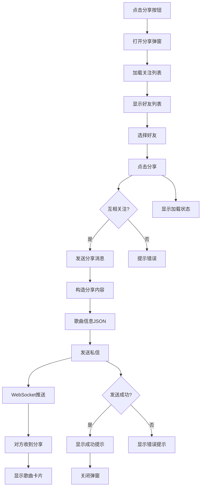

## 7. 播放器流程

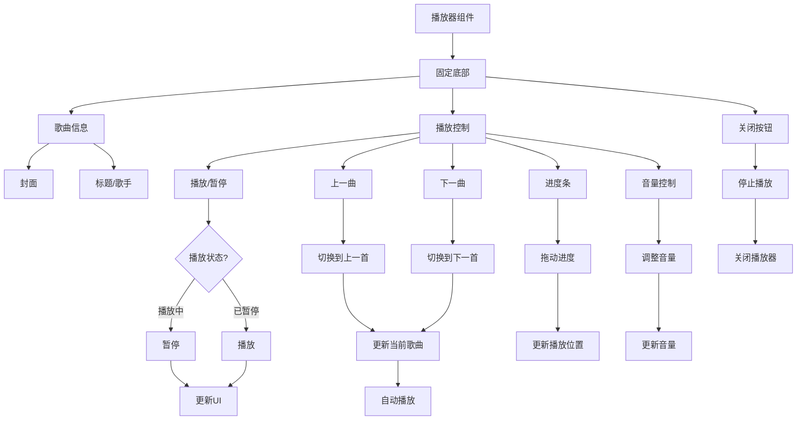

## 8. 个人资料页流程

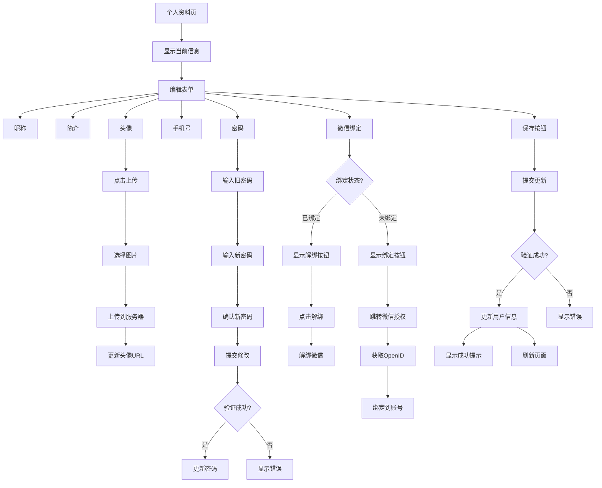

## 9. WebSocket实时通信流程

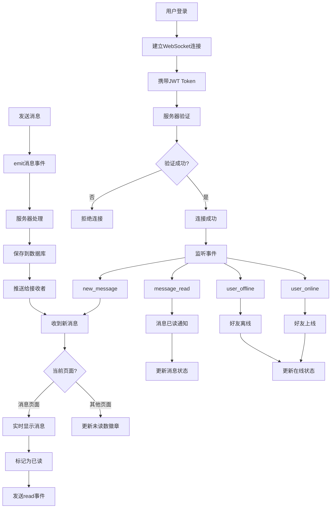

## 10. 数据流向图

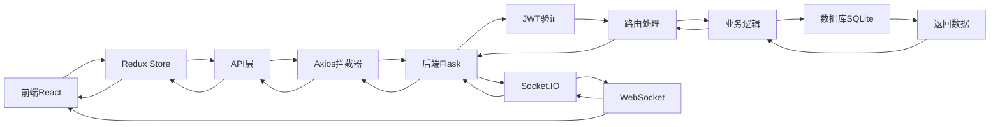

## 11. 页面导航关系图

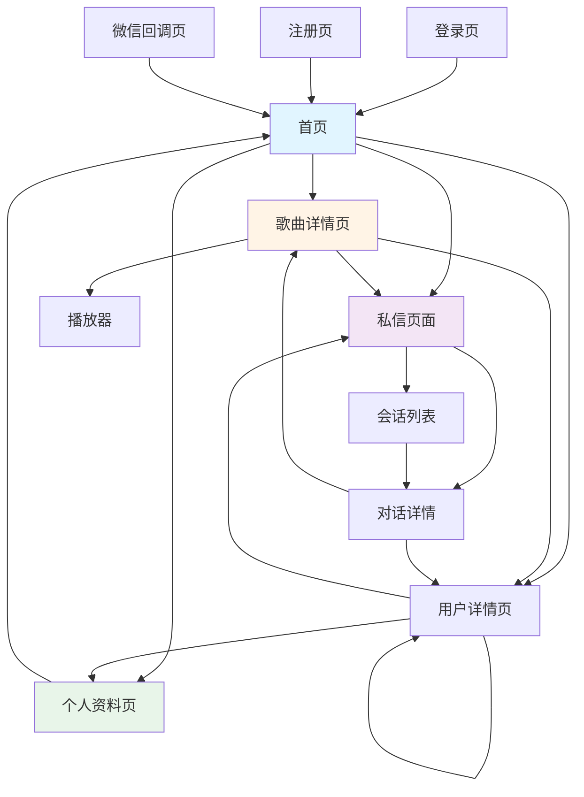

## 12. 权限控制流程

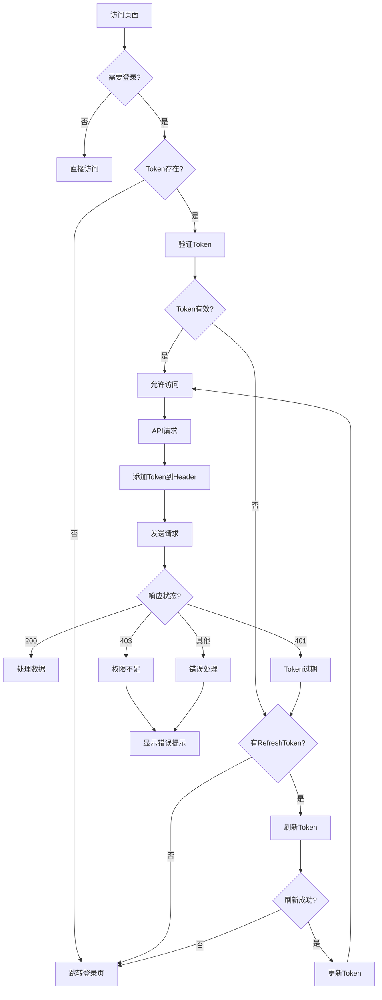

## 13. 移动端响应式适配流程

```mermaid
graph TD
    A[页面加载] --> B[检测屏幕宽度]
    B --> C{宽度判断}

    C -->|<576px| D[移动端布局]
    C -->|576-768px| E[平板布局]
    C -->|>768px| F[桌面端布局]

    D --> D1[单列布局]
    D --> D2[隐藏次要信息]
    D --> D3[图标按钮]
    D --> D4[全屏显示]
    D --> D5[底部导航]

    E --> E1[两列布局]
    E --> E2[部分信息]
    E --> E3[混合按钮]

    F --> F1[多列布局]
    F --> F2[完整信息]
    F --> F3[文字按钮]
    F --> F4[侧边栏]
    F --> F5[顶部导航]

    G[组件渲染] --> H[CSS媒体查询]
    H --> I[@media max-width: 768px]
    H --> J[@media min-width: 769px]

    I --> D
    J --> F
```

---

## 使用说明

这个文档包含了OnBeat应用的完整交互流程图，使用Mermaid语法编写。

**查看方式：**
1. 使用支持Mermaid的Markdown编辑器（如Typora）
2. 在VS Code中安装Mermaid插件
3. 在GitHub上直接查看（GitHub原生支持Mermaid）
4. 使用在线Mermaid编辑器：https://mermaid.live/

**流程图说明：**
- 矩形框：操作或状态
- 菱形框：判断条件
- 圆角矩形：页面或组件
- 箭头：流程方向
- 虚线：可选流程
